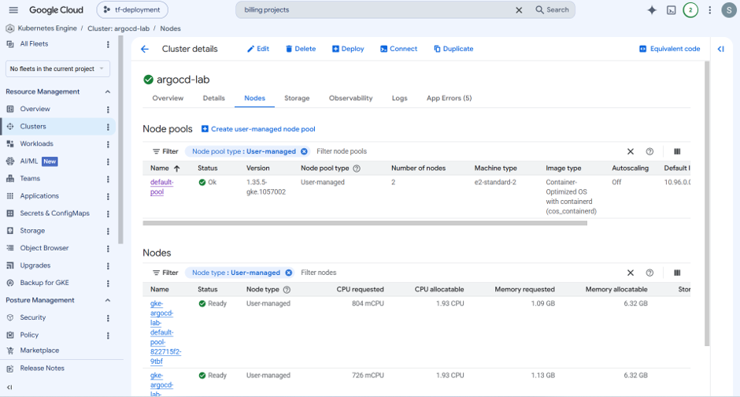
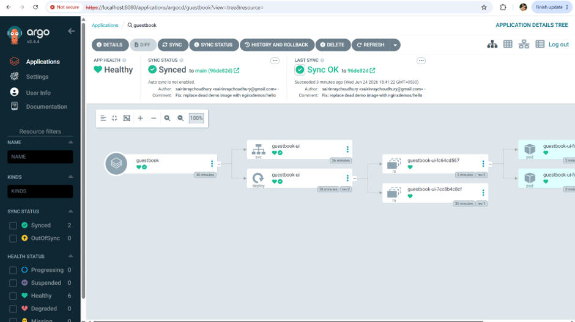
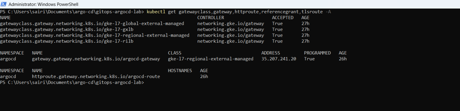
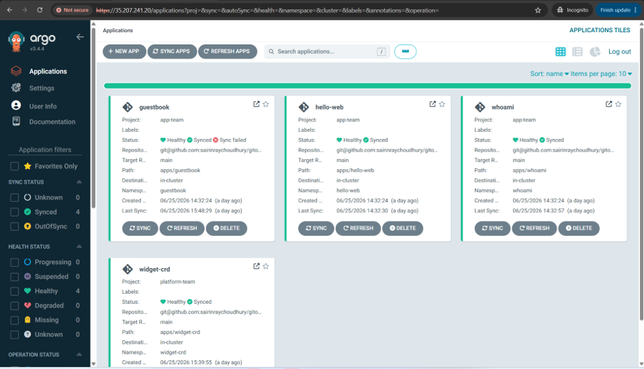
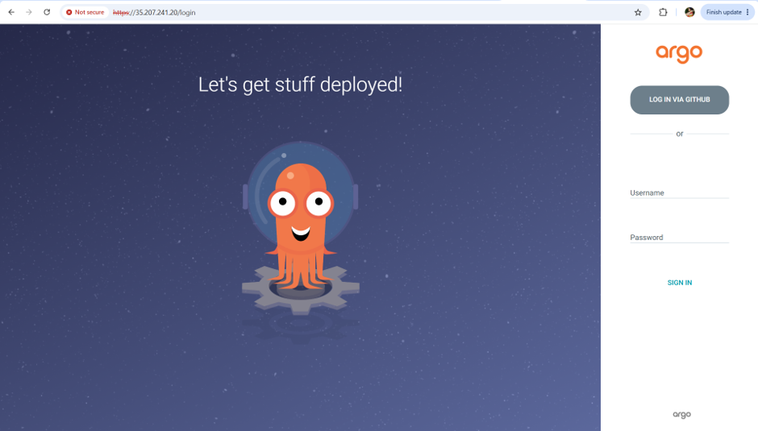
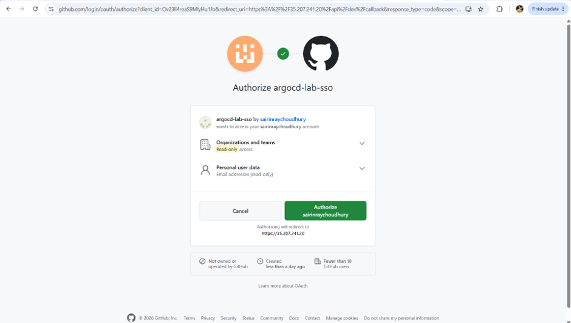

# ArgoCD GitOps Lab on GKE

## Overview

This repository contains the setup and configuration for deploying and managing applications on **Google Kubernetes Engine (GKE)** using **ArgoCD** following GitOps principles.

## Features

- Google Kubernetes Engine (GKE)
- ArgoCD Installation
- GitOps Deployment
- AppProjects
- Root Application Pattern
- RBAC
- GitHub SSO
- Gateway API
- Sync Waves & Hooks
- Custom Health Checks

---

# Prerequisites

Install the following tools before starting:

- Google Cloud SDK
- kubectl
- Git
- Chocolatey (Windows)
- ArgoCD CLI

---

# 1. Install Google Cloud SDK

```powershell
(New-Object Net.WebClient).DownloadFile(
"https://dl.google.com/dl/cloudsdk/channels/rapid/GoogleCloudSDKInstaller.exe",
"$env:Temp\GoogleCloudSDKInstaller.exe"
)

& $env:Temp\GoogleCloudSDKInstaller.exe
```

Initialize Google Cloud:

```powershell
gcloud init

gcloud config set project <PROJECT_ID>

gcloud config set compute/region asia-south1
gcloud config set compute/zone asia-south1-a
```

Enable required APIs:

```powershell
gcloud services enable container.googleapis.com compute.googleapis.com
```

---

# 2. Create GKE Cluster

```powershell
gcloud container clusters create argocd-lab `
    --zone asia-south1-a `
    --num-nodes 2 `
    --machine-type e2-standard-2 `
    --enable-ip-alias `
    --release-channel regular `
    --workload-pool=<PROJECT_ID>.svc.id.goog
```

Install the GKE authentication plugin:

```powershell
gcloud components install gke-gcloud-auth-plugin

$env:USE_GKE_GCLOUD_AUTH_PLUGIN="True"
```

Configure kubectl:

```powershell
gcloud container clusters get-credentials argocd-lab --zone asia-south1-a

kubectl get nodes
```

---

# 3. Install ArgoCD

Create the namespace:

```powershell
kubectl create namespace argocd
```

Install ArgoCD:

```powershell
kubectl apply --server-side -n argocd \
-f https://raw.githubusercontent.com/argoproj/argo-cd/stable/manifests/install.yaml
```

Expose the ArgoCD UI locally:

```powershell
kubectl port-forward svc/argocd-server -n argocd 8080:443
```

Retrieve the initial admin password:

```powershell
kubectl -n argocd get secret argocd-initial-admin-secret `
-o jsonpath="{.data.password}" |
ForEach-Object {
    [System.Text.Encoding]::UTF8.GetString(
        [System.Convert]::FromBase64String($_)
    )
}
```

> **Important:** Change the default admin password after the first login.

---

# 4. Install ArgoCD CLI

```powershell
choco install argocd-cli
```

Login:

```powershell
argocd login localhost:8080 \
    --username admin \
    --password <PASSWORD> \
    --insecure
```

---

# 5. Bootstrap AppProjects

Apply the AppProjects and bootstrap application:

```bash
kubectl apply -f infra/appprojects/app-team-project.yaml

kubectl apply -f infra/appprojects/platform-team-project.yaml

kubectl apply -f infra/widget-crd-app.yaml
```


---

# 6. Configure Gateway API

Create the managed proxy subnet:

```powershell
gcloud compute networks subnets create proxy-only-subnet-asia-south1 \
    --purpose=REGIONAL_MANAGED_PROXY \
    --role=ACTIVE \
    --region=asia-south1 \
    --network=default \
    --range=10.10.0.0/23
```



---

# 7. Configure GitHub SSO

1. Create a GitHub OAuth Application.
2. Configure the callback URL.
3. Store the Client ID and Client Secret securely.
4. Update the ArgoCD Dex configuration.

> **Never commit Client Secrets or passwords to Git.**




---

# 8. Git History Cleanup (If a Secret Was Committed)

```bash
git filter-branch --force \
--index-filter 'git rm --cached --ignore-unmatch <FILE>' \
--prune-empty \
--tag-name-filter cat \
-- --all
```

After cleaning the history:

- Regenerate the secret.
- Update Kubernetes Secrets.
- Force push only if required.

---

# Kubernetes Workloads


---

# Repository Structure

```text
.
├── applications/
├── infra/
│   ├── appprojects/
│   ├── widget-crd-app.yaml
│   └── ...
├── root-apps/
└── README.md
```

---

# Architecture

```
Git Repository
      │
      ▼
  Root Application
      │
      ▼
  AppProjects
      │
      ▼
 Applications
      │
      ▼
 Kubernetes Cluster (GKE)
```

---

# Best Practices

- Never commit secrets to Git.
- Rotate credentials immediately if exposed.
- Use Kubernetes Secrets or Secret Manager.
- Protect the main branch.
- Use Pull Requests.
- Use AppProjects for RBAC isolation.
- Enable automated sync only after validation.
- Keep manifests declarative.

---

# Additional Topics Covered

- Root Application Pattern
- Sync Waves
- Sync Hooks
- Custom Health Checks
- RBAC
- GitHub SSO
- Gateway API
- Multi-Team GitOps

---

# References

- ArgoCD Documentation
- Kubernetes Documentation
- Google Kubernetes Engine Documentation
- Google Cloud SDK Documentation

---

# License

This project is intended for learning and internal use.